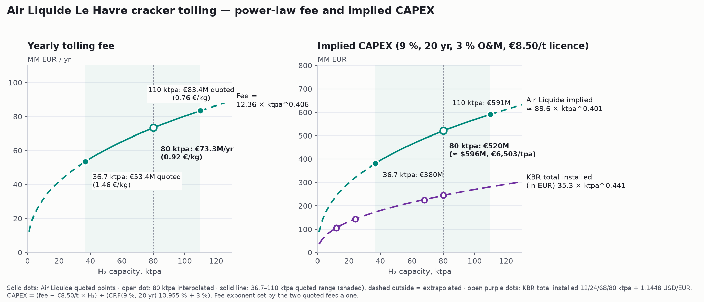
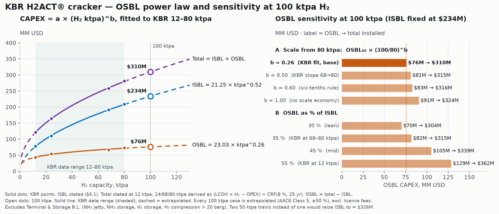

# NH₃ Cracker Design module — data provenance

`public/modules/nh3-cracker-design.html` sizes an ammonia cracker from a
required H₂ capacity and returns technical sizing, CAPEX, OPEX and LCOH. All
source figures come from the `Gentari-ammoniacracker` repository:

- `Licensor/kbr/kbr-johor-hub.md` and `Licensor/kbr/I.E_GENTARIFeed__Product_ALL_Rev0.md`
  (KBR H2ACT®, Rev 0, 23 Dec 2025)
- `Licensor/duiker/duiker-johor-hub.md` (Duiker AHC, Budgetary Proposal 122380, 05 Dec 2025)
- `Licensor/Casale/…` (process description, used for the flow diagram checks only)
- `tolling/vopak/…`, `tolling/vtti/…` (tolling route)

## Technology bases

| Basis | Fuel modes | Notes |
|---|---|---|
| KBR H2ACT® | NG100, NG50, CF100 | Interpolated between 12/24/68/80 ktpa data points; held at the end values outside that range |
| Duiker AHC | NH₃-fired, NG-fired | Single 12 ktpa data point |
| Custom | 100 % clean fuel (7.2), natural gas (6.5), maximum NG (5.7) | Gentari basis: 5.66 kg NH₃ per kg H₂ to product, 1.54 kg NH₃-eq of firing. Maximum NG needs a double PSA; CAPEX uplift is an input (default 10 %) |

Casale is excluded from the cost model (technical-only package).

## CAPEX curves

CAPEX = a × (H₂ ktpa)^b, least-squares fit in log space, computed at runtime.

- **KBR ISBL** — stated points (§4.1): 78 / 110 / 191 / 209 MM USD. b ≈ 0.52.
- **KBR total installed** — 120.9 MM USD at 12 ktpa is stated (§4.2). 24/68/80 ktpa
  are derived from KBR's own LCOH: (LCOH × H₂ − OPEX) ÷ CRF(8 %, 25 yr), averaged over
  the price points and fuel modes (≈ 164 / 258 / 281 MM USD). This method reproduces
  the stated 120.9 at 12 ktpa. b ≈ 0.44. Implied OSBL falls from 55 % to ≈ 35 % of ISBL,
  consistent with KBR's note that OSBL "reduces for larger capacity".
- **KBR OSBL** — total − ISBL at each point (42.9 / 54.4 / 66.8 / 72.4 MM USD), fitted as its own power
  law: 23.03 × ktpa^0.259. Since 2026-10-03 the model's KBR CAPEX is **ISBL fit + OSBL fit**, and the CAPEX
  tab shows both parts. This is within 0.4 % of the single total fit across 12–100 ktpa; the total fit stays
  in the fit table as a reference and still sets the default Duiker exponent.
- **Duiker** — €47M at 12 ktpa (lump-sum turnkey incl. buildings, civil, EPC and the
  construction licence fee, Table 8), converted at the FX input. Only one point, so the
  exponent is borrowed from the KBR total fit (editable).

## OPEX

Ammonia is split into two cost lines: cracked to product H₂ and used as fuel. The product
share uses 5.63 t/t for KBR (KBR §4.2: 33.8 MM$ "ammonia cracked for product" at 500 USD/t,
12 ktpa) and 5.66 t/t for Duiker and Custom (Duiker Table 1: 5.66/7.03). KBR's KPI ratio of
6.40 t/t at 12 ktpa NG100 exceeds the 6.35 its OPEX split implies, so the model's NH₃-fuel
line reads 4.6 MM$ against KBR's 4.3 MM$.

Bottom-up: quantities × user prices (NH₃ USD/t, electricity USD/MWh, NG USD/MWh LHV),
plus reference-specific lines:

- KBR other consumables: 0.4 MM USD/yr at 12 ktpa → 33.3 USD/t H₂.
- KBR fixed O&M: 6.9 MM USD at 12 ktpa (stated); 24/68/80 ktpa derived from the OPEX
  slope between KBR's NH₃ price points, less NG, power and consumables (≈ 8.3–8.9 MM USD).
  Fitted power law, exponent ≈ 0.11.
- Duiker: catalyst €0.2M/yr (variable), labour + maintenance €0.5M/yr (fixed, scaled with
  the KBR fixed-cost exponent), operation licence fee €8.50/t H₂.

LCOH = (CAPEX × CRF + OPEX) ÷ H₂. On KBR's basis at 12 ktpa NG100 the model gives
4.95 USD/kg against KBR's published 4.90 (+1.0 %; 4.94 before CAPEX became ISBL + OSBL).

## Flagged discrepancies

- Duiker NH₃-fired ratio: Tables 1 and 7 say 7.03 t/t, §3 text says 7.05. The module uses
  7.03; `tools/cracker_model/data.py` in the cracker repo uses 7.05.
- Duiker construction licence fee: Table 8 and §4.2 include it in the €47M; `data.py`
  treats the €2.7M as additive.
- Custom natural-gas and clean-fuel tail gas of 0.84 kg NH₃-eq implies 87.1 % PSA recovery,
  not the 88 % given in the earlier Gentari description.
- 5.66 kg NH₃/kg H₂ uses rounded molar masses; the exact value is 5.63.

## Link to storage model

"🔗 Link model to storage" writes `localStorage["gentari.link.crackerToStorage.v1"]`
(`{ throughputKtpa, h2OutputKtpa, licensor, fuelMode, ts }`). The storage module reads
the key on load and offers to apply the NH₃ throughput as `demand.throughputKtpa`, then
clears it.

## Natural gas price unit (added 2026-09-30)

The NG price input has a unit dropdown, USD/MWh or USD/MMBtu. The model works in USD/MWh
(LHV energy); MMBtu input is converted with 1 MWh = 3.6 GJ ÷ 1.055056 GJ/MMBtu = 3.4121 MMBtu.
This is an energy-unit conversion only. Gas quoted per MMBtu is usually on an HHV basis while the
model consumes LHV energy, so adjust the price if you need that basis. Switching the unit keeps
the same price and re-expresses it.

## Custom fuel mode (added 2026-09-30)

With basis = Custom, the Fuel mode list has a fourth option, "Custom — enter your own numbers".
Inputs: NH₃ drawn from storage (t/t H₂), NH₃ cracked (t/t H₂), natural-gas firing (kg NH₃-eq/kg H₂),
single or double PSA. Derived as for the three preset pathways: tail gas = cracked − 5.66, direct NH₃ =
feed − cracked, NG CO₂ from the KBR I.E emission factor. Cracked is clamped to ≥ 5.66 and feed to
≥ cracked, with a flag shown. Defaults equal the 100 % clean-fuel pathway. CAPEX, power and fixed
O&M follow the chosen reference curve; double PSA applies the CAPEX uplift input. Not licensor-quoted.

## OSBL equipment tab (added 2026-09-30)

Lists KBR's OSBL equipment (I.H, Units 101–114, 40 items) sized for the H₂ capacity entered, plus a
scaling curve of any one item versus H₂ output. Port of `tools/kbr_osbl_workbook.py` in
Gentari-ammoniacracker (its 12 / 24 / 80 / 160 ktpa results are reproduced exactly: genset
1,080 / 1,929 / 6,121 / 12,241 kWe). Between 12, 24 and 80 ktpa, power, NG, NH₃ feed and H₂ are
interpolated linearly from I.E; above 80 and below 12 ktpa they scale proportionally. All I.F
utility maxima scale linearly from 12 ktpa. 160 ktpa is extrapolated. Six items are TBD (fire water,
flare KO drum heater, off-spec tank, oil-water package, ammoniacal drain drum and pumps). The list is
KBR's, so for Duiker or Custom it is only an indicative OSBL reference. Assumptions A1–A14 are editable
on the tab; emergency power keeps the repo owner's ×2 load allowance and flags KBR I.F Note 9 (0.3 MW).

## Footprint and CO₂ mass balance (added 2026-09-30)

Technical sizing now shows **plot footprint, ISBL + OSBL**. ISBL comes from licensor plot data: KBR §3.6
(power-law fit, 1,225.8 × ktpa^0.41 m²) or Duiker §3.10 (two-point fit, 162.6 × ktpa^0.69 m²). No OSBL
area exists in the KBR, Duiker or Casale packages, so OSBL is an input, **% of ISBL, default 200 % (was 50 %), an
assumption to replace with a site layout**. KBR ISBL excludes offsites and utilities; Duiker excludes NH₃
storage and H₂ compression above 50 barg.

Technical sizing also shows **direct CO₂ from a carbon balance** next to the licensor figure: NG burned ×
carbon fraction × 44.01/12.011. NG composition is KBR I.A §5 (MW 16.95, 75.1 wt % C) giving 2.752 kg CO₂/kg NG,
identical to KBR I.E (1,150 kg/h ÷ 417.9 kg/h). It reproduces KBR's 0.81 / 0.45 / 0.00. For Duiker NG-fired
its own Table 6 fuel (145 kg/h N₂-rich NG per 1,500 kg/h H₂, composition in the table) gives 0.206 against the stated 0.21, so it agrees. CO₂ only; N₂O and
CH₄ slip are not in any source, so CO₂e = CO₂.
Footprint is also shown in acres (1 acre = 4,046.86 m²).

## Display units and Duiker process flow (added 2026-09-30)

Technical sizing shows footprint with sqft as the main unit (acre, m², ha secondary; ISBL / OSBL tile in sqft with acre
secondary) and both direct-CO₂ tiles with kgCO₂e/kg H₂ as the main unit. The NH₃ cracker block is purple in the flow
diagrams. With the Duiker basis the process flow switches to a Duiker AHC diagram drawn from Duiker §3.2 and §3.6 with
Tables 5–6 flows per kg H₂ (NH₃ pump and vaporiser, convective cracking reactor, SCO combustor, heat recovery, PSA,
optional SCR, stack with CEMS; NG stream in NG-fired mode). Duiker's own Figure 3 is not extractable from the converted
package, so the drawing follows the text.

OSBL plot area default is now 200 % of ISBL (owner instruction, still an assumption). Footprint fits and sources are quoted in sqft first, m² in brackets.

## Process flow follows the licensor basis (added 2026-09-30)

The Process flow panel follows the Licensor / fuel mode basis: KBR H2ACT® draws the KBR diagram, Duiker AHC draws the Duiker
diagram, Custom keeps the original pathway diagram with its pathway buttons. The KBR and Duiker drawings reproduce
`tcoedatabase/figures/kbr_h2act_block_diagram.png` and `duiker_ahc_block_diagram.png` from Gentari-ammoniacracker (KBR I.D
Process Description; Duiker §2–3.9 and Tables 5–7), with the NH₃ cracker units in purple. Labels are per kg H₂ and follow the fuel
mode: KBR shows PSA tail gas always, the cracked-gas split in CF100 and NG50, natural gas in NG100 and NG50; Duiker shows the
Table 5 (NH₃-fired) or Table 6 (NG-fired) flows. KBR's drawing is the clean-fuel layout; Duiker's heat-exchanger network is
indicative and its Figure 3 is not reproduced.

## Air Liquide Le Havre tolling reference (added 2026-10-01)

Fourth tolling reference: yearly fee **€83.4M at 110 ktpa H₂** and **€53.4M at 36.7 ktpa H₂** (Air Liquide, Le Havre,
France, figures passed on by Gentari). Tariff shown as fee ÷ capacity: €0.76–1.46/kg H₂. Air Liquide gave no NH₃:H₂
ratio, so the VTTI range 6.3–7.3 t/t is borrowed for the feed estimate. Scope, term, indexation and passthrough are
not stated.

When this reference is selected, an **Implied CAPEX** panel back-calculates installed CAPEX from the fee:

CAPEX = (yearly fee − operating licence fee × H₂) ÷ (CRF(rate, term) + fixed O&M %)

| Assumption | Default | Note |
|---|---|---|
| Fee covers | Capital recovery, fixed O&M, operator return | NH₃, energy and utilities passed through |
| Discount rate | 9 % real, pre-tax | Gentari instruction |
| Recovery period | 20 years | Tolling term (Vopak LoI 15–20 yr) |
| Fixed O&M | 3 % of CAPEX/yr, excl. licence fees | KBR implies ≈ 5.7 % at 12 ktpa, ≈ 3.2 % at 80 ktpa; KBR excludes licence fees (§4.1) |
| Operating licence fee | €8.50/t H₂ | Duiker §4.2 Plant Operation License Fee |
| Construction licence fee | Inside CAPEX | Duiker §4.2: €2.7M per train up to 276 tpd H₂, capacity-adjusted (method not disclosed) |
| Fee profile / CAPEX basis | Flat real fee on booked capacity; overnight CAPEX, no IDC, no residual value, pre-tax | |
| FX | 1.1448 USD/EUR | Same default as the own-and-operate route |

Defaults give **€591.0M at 110 ktpa** and **€380.4M at 36.7 ktpa** (CRF 10.955 %). Fee at other capacities follows the
power law through the two points (exponent 0.406, set by the fee ratio alone); implied CAPEX scales ≈ 89.6 × ktpa^0.401 MM EUR.
Outside 36.7–110 ktpa the result is flagged as extrapolated. All five inputs are editable on the panel.

At 80 ktpa: fee 12.36 × 80^0.406 = €73.3M/yr; less licence €0.68M; ÷ 0.13955 → **€520M** (≈ $596M, €6,503/tpa).

Duiker licence-fee gaps: §4.2 says the operation fee is in "Table 7" (a performance table); Table 9 OPEX (€2.9M) sums
utilities, labour, maintenance and catalyst only, so the fee is not visible there. Gentari-ammoniacracker
`calc_opex.py` also annualises the €2.7M construction fee into OPEX over 25 yr while `data.py` treats it as additive to
the €47M — a double count against Duiker's text.

## KBR OSBL power law and 100 ktpa sensitivity (added 2026-10-03)

OSBL at each KBR capacity = total installed − ISBL: 42.9 / 54.4 / 66.8 / 72.4 MM USD at 12 / 24 / 68 / 80 ktpa
(55 % → 35 % of ISBL). Log-space fits: ISBL = 21.25 × ktpa^0.521, OSBL = 23.03 × ktpa^0.259 (R² 0.984).

At 100 ktpa (extrapolated): ISBL **$234M**, OSBL **$76M**, total **$310M**. Sensitivity on OSBL, ISBL held at $234M:

| Case | OSBL | Total |
|---|---|---|
| OSBL₈₀ × 1.25^b, b = 0.26 (KBR fit, base) | 76 | 310 |
| b = 0.50 (KBR slope 68→80) | 81 | 315 |
| b = 0.60 (six-tenths rule) | 83 | 316 |
| b = 1.00 (no scale economy) | 91 | 324 |
| 30 % of ISBL | 70 | 304 |
| 35 % of ISBL (KBR at 68–80 ktpa) | 82 | 315 |
| 45 % of ISBL | 105 | 339 |
| 55 % of ISBL (KBR at 12 ktpa) | 129 | 362 |

Two 50 ktpa trains instead of one would put ISBL at ≈ $326M.

**Terminal & Storage B.L.** (Gentari definition, 2026-10-03): the scope outside KBR's OSBL, costed separately — NH₃ jetty,
NH₃ storage and storage flare, H₂ storage, H₂ compression above 20 barg. Basis: KBR's OSBL equipment list (I.H, Units
101–114) covers utilities, flare, air, N₂, water, waste water and H₂ export metering only; §1 and §4.1 name storage, jetty
and H₂ storage as OSBL but KBR does not say what its ~55 % OSBL cost factor covers, so this split is Gentari's reading.
Buildings and laboratories appear in §1/§4.1 but not in I.H; confirm with KBR.

