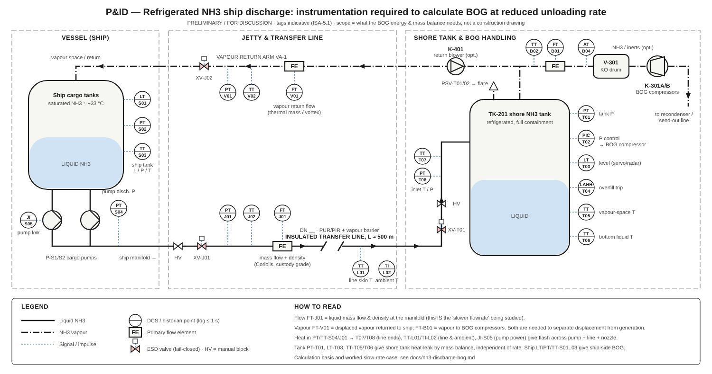

# NH3 ship discharge — BOG at reduced unloading rate

Preliminary P&ID and calculation basis for the boil-off gas (BOG) generated while a refrigerated
ammonia carrier discharges into a shore tank at a **slower than design rate**.



Vector original: [`figures/nh3-discharge-bog-pid.svg`](figures/nh3-discharge-bog-pid.svg).
Status: **preliminary, for discussion.** The drawing shows only what the BOG balance needs — it is
not a construction P&ID (no line numbers, specs, relief sizing, drains/vents, utilities).

## 1. Why a slower rate changes BOG

| Term | Driven by | Effect of slower discharge |
|---|---|---|
| Displaced vapour (`ṁ_disp = V̇_liq · ρ_vap`) | liquid volume rate | **falls** in proportion to rate — but it is only a *load* if the vapour return line is not used |
| Pump heat → flash (`Q_pump = ṁ·ΔP / (ρ·η)`) | pump duty point | rate falls, but the pumps run off-BEP / throttled: η drops and ΔP rises, so **kW per tonne rises** |
| Transfer-line heat ingress (`Q_line`) | line length, insulation, ambient | fixed kW → **more kg BOG per tonne** (longer residence, longer discharge) |
| Shore tank heat leak | tank, ambient | fixed kg/h, independent of rate → **per tonne ∝ discharge hours** |
| Ship tank heat ingress | cargo, ambient | same: fixed kg/h, discharge takes longer |
| Flash at inlet nozzle | `cp·(T_in − T_sat(P_tank)) / λ` | depends on ship-tank vs shore-tank pressure and line ΔT |

So BOG **rate** (t/h) barely changes with rate (heat terms dominate), but BOG **per tonne
discharged** rises steeply as the rate falls. Both numbers are needed.

## 2. BOG balance (what the instruments close)

```
V̇_liq      = FT-J01 mass flow ÷ FT-J01 density
ṁ_disp     = V̇_liq · ρ_vap(P_tank, T_vap)                 expected on FT-V01 if return is used
ṁ_flash    = (Q_pump + Q_line + Q_valve) / λ  +  ṁ_liq · cp · (T_in − T_sat(P_tank)) / λ
Q_pump     = ṁ_liq · (PT-J01 − suction P) / (ρ · η)       or measured from JI-S05
ṁ_leak,shore = ρ_vap · dV_vap/dt + ṁ_out  from PT-T01, LT-T03, TT-T05/T06 (rate-independent)
ṁ_gen,ship = from LT/PT/TT-S01..03 vs time

BOG_net    = ṁ_flash + ṁ_leak,shore + ṁ_gen,ship          what K-301 must handle (return line healthy)
BOG_gross  = BOG_net + ṁ_disp                              what K-301 must handle (no vapour return)
Check      : FT-B01 + FT-V01  ≈  ṁ_disp + ṁ_flash + ṁ_leak   (residual = instrument or model error)
```

## 3. Instruments required (tags on the drawing)

| Tag | Service | Why it is needed | Priority |
|---|---|---|---|
| FT-J01 (+ density) | Liquid flow at ship manifold, mass + density, custody grade | Defines the unloading rate under study; V̇_liq and ṁ_liq | **Must** |
| PT-J01, TT-J02 | Manifold P and T (ship side of line) | Pump ΔP, ship-side liquid state | **Must** |
| PT-S04, JI-S05 | Ship pump discharge P, pump kW / amps | Pump-heat term; off-BEP efficiency at slow rate | **Must** |
| LT/PT/TT-S01..03 | Ship cargo tank L / P / T | Ship-side generation, saturation T of cargo | **Must** |
| TT-T07, PT-T08 | Inlet T and P at shore tank nozzle | Flash at nozzle; heat pick-up across line | **Must** |
| FT-V01, PT-V01, TT-V02 | Vapour return flow, P, T | Splits displaced vapour from generated BOG | **Must** (if return used) |
| FT-B01, TT-B02 | Vapour to BOG compressors, T | Total BOG handled; closes the balance | **Must** |
| PT-T01, PIC-T02, LT-T03, TT-T05/T06, LAHH-T04 | Shore tank P control, level, vapour/liquid T, overfill trip | Tank heat-leak by mass balance; safe operating envelope | **Must** |
| TT-L01, TI-L02 | Transfer-line skin T (mid), ambient T | Line heat-ingress term; model validation | Should |
| AT-B04 | NH3 / inerts in BOG | Corrects ρ_vap and λ if N2/air in vapour space | Optional |
| K-401 | Vapour return blower | Only if ship cannot self-pressurise return | Optional |
| XV-J01/J02, XV-T01, PSV-T01/02 | ESD valves, tank relief | Shown for completeness of the BOG envelope | — |

Logging: ≤ 1 s historian for the "Must" points; a ramp test (e.g. 100 % → 75 % → 50 % → 25 % of
design rate, 30–60 min per step at steady state) gives the data to fit the pump-η and leak terms.

## 4. Worked example — illustrative only

Assumptions (placeholders — **replace with vessel/terminal data**): 30,000 t parcel; ρ_liq 682 kg/m³;
ρ_vap 0.92 kg/m³; λ 1,370 kJ/kg; two cargo pumps, BEP 2,200 m³/h at 130 m, η_bep 75 %, throttled
(not VFD) at part rate, η = η_bep·(1−(Q/Q_bep−1)²) floored at 25 %; head curve
H = H_bep·(1.25 − 0.25·(Q/Q_bep)²); ship heat ingress 0.15 %/day of cargo; shore tank 60 kt at
0.04 %/day; line 500 m at 30 W/m.

| Unloading rate | Pump η | Pump heat kW | Flash t/h | Displaced vapour t/h | **BOG_net t/h** | **BOG_net kg/t** | BOG_gross kg/t | Discharge h |
|---|---|---|---|---|---|---|---|---|
| 1,500 t/h (design) | 0.75 | 709 | 1.86 | 2.02 | 4.78 | **3.2** | 4.5 | 20 |
| 1,000 t/h | 0.67 | 605 | 1.59 | 1.35 | 4.50 | **4.5** | 5.9 | 30 |
| 750 t/h | 0.56 | 561 | 1.47 | 1.01 | 4.39 | **5.9** | 7.2 | 40 |
| 500 t/h | 0.42 | 520 | 1.37 | 0.67 | 4.28 | **8.6** | 9.9 | 60 |
| 250 t/h | 0.25 | 440 | 1.16 | 0.34 | 4.07 | **16.3** | 17.6 | 120 |

Reading it: halving the rate (1,500 → 750 t/h) leaves BOG_net almost unchanged in t/h (4.8 → 4.4)
but **roughly doubles BOG per tonne** (3.2 → 5.9 kg/t) and doubles total BOG over the call
(96 t → 176 t), because the fixed heat terms act for twice as long. The ship-side heat ingress
(1.9 t/h) is the largest single term and sits on the ship's vapour space, so check who pays for it
under the charter terms. Pump heat falls in absolute terms but stays the biggest *controllable*
term — a VFD or one-pump-at-BEP strategy reduces it.

Assumptions most worth replacing first: ship heat-ingress %/day, pump curves/η at part load, and
line heat gain W/m (these three set the answer); ρ_vap and λ are insensitive.

## 5. Open items for the real P&ID

- Confirm tank inlet arrangement (top-fill vs bottom-fill / dip pipe) — decides where the flash lands.
- Confirm whether the vessel returns vapour (and its manifold arm / ESD arrangement) or the terminal supplies make-up vapour.
- Line size, insulation spec and any recirculation / cool-down loop on the 500 m line (line length is the module default).
- Whether cargo pumps are VFD-driven (changes the slow-rate pump-heat term materially).
- BOG compressor / recondenser capacity at the highest BOG_gross case, including 250 t/h.
