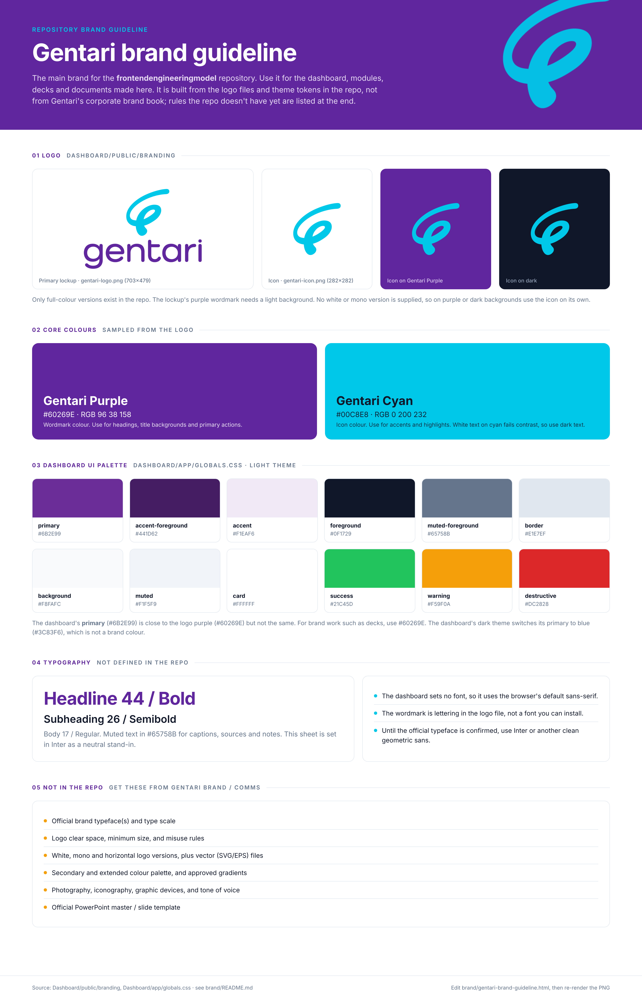

# Gentari brand guideline

This is the main brand for this repository. Use it for the dashboard, the modules
in `Dashboard/public/modules/`, and any decks or documents made from this repo.



The guideline is built from the logo files and theme tokens already in the repo. It
is not Gentari's corporate brand book. The rules the repo doesn't have yet are listed
under [Not yet defined](#not-yet-defined).

| File | What it is |
| --- | --- |
| [`gentari-brand-guideline.png`](./gentari-brand-guideline.png) | The guideline as one image (3200 × 4978) |
| [`gentari-brand-guideline.html`](./gentari-brand-guideline.html) | Source for the PNG |

## Logo

Files are in [`Dashboard/public/branding/`](../Dashboard/public/branding):

| File | Use |
| --- | --- |
| `gentari-logo.png` (703 × 479) | Primary lockup: cyan icon above the purple "gentari" wordmark. Light backgrounds only. |
| `gentari-icon.png` (282 × 282) | Cyan icon alone. Works on white, Gentari Purple and dark backgrounds. |

Only full-colour PNGs exist. There is no white or mono version, so on purple or
dark backgrounds use the icon on its own.

## Core colours

Sampled from the logo files.

| Name | Hex | RGB | Use |
| --- | --- | --- | --- |
| Gentari Purple | `#60269E` | 96 38 158 | Wordmark colour. Headings, title backgrounds, primary actions. |
| Gentari Cyan | `#00C8E8` | 0 200 232 | Icon colour. Accents and highlights. Use dark text on it; white text on cyan fails contrast. |

## Dashboard UI palette

Light-theme tokens from [`Dashboard/app/globals.css`](../Dashboard/app/globals.css),
which defines them as HSL. The hex values are conversions.

| Token | HSL | Hex |
| --- | --- | --- |
| `primary` | 274 54% 39% | `#6B2E99` |
| `accent-foreground` | 274 54% 25% | `#441D62` |
| `accent` | 274 40% 94% | `#F1EAF6` |
| `foreground` | 222 47% 11% | `#0F1729` |
| `muted-foreground` | 215 16% 47% | `#65758B` |
| `border` | 214 32% 91% | `#E1E7EF` |
| `background` | 210 40% 98% | `#F8FAFC` |
| `muted` | 210 40% 96% | `#F1F5F9` |
| `card` | 0 0% 100% | `#FFFFFF` |
| `success` | 142 71% 45% | `#21C45D` |
| `warning` | 38 92% 50% | `#F59F0A` |
| `destructive` | 0 72% 51% | `#DC2828` |

The dashboard's `primary` (`#6B2E99`) is close to Gentari Purple (`#60269E`) but
not the same. For brand work such as decks, use `#60269E`. The dark theme switches
`primary` to blue (`217 91% 60%`), which is not a brand colour.

## Typography

The repo doesn't define a brand typeface. The dashboard sets no font, so it uses
the browser's default sans-serif. The wordmark is lettering in the logo file, not
an installable font. Until the official typeface is confirmed, use Inter or another
clean geometric sans. The guideline image is set in Inter.

## Not yet defined

Get these from Gentari Brand / Comms and add them here:

- Official brand typeface(s) and type scale
- Logo clear space, minimum size and misuse rules
- White, mono and horizontal logo versions, plus vector (SVG/EPS) files
- Secondary and extended colour palette, and approved gradients
- Photography, iconography, graphic devices and tone of voice
- Official PowerPoint master / slide template

## Updating the guideline

Edit `gentari-brand-guideline.html` (it loads the logos from
`Dashboard/public/branding/`), then re-render the PNG at 1600 px wide and 2× scale,
for example with Playwright:

```js
const { chromium } = require("playwright");
const browser = await chromium.launch();
const page = await browser.newPage({ viewport: { width: 1600, height: 900 }, deviceScaleFactor: 2 });
await page.goto("file://" + require("path").resolve("brand/gentari-brand-guideline.html"));
await page.screenshot({ path: "brand/gentari-brand-guideline.png", fullPage: true });
await browser.close();
```

Keep this README, the HTML and the PNG in step.
